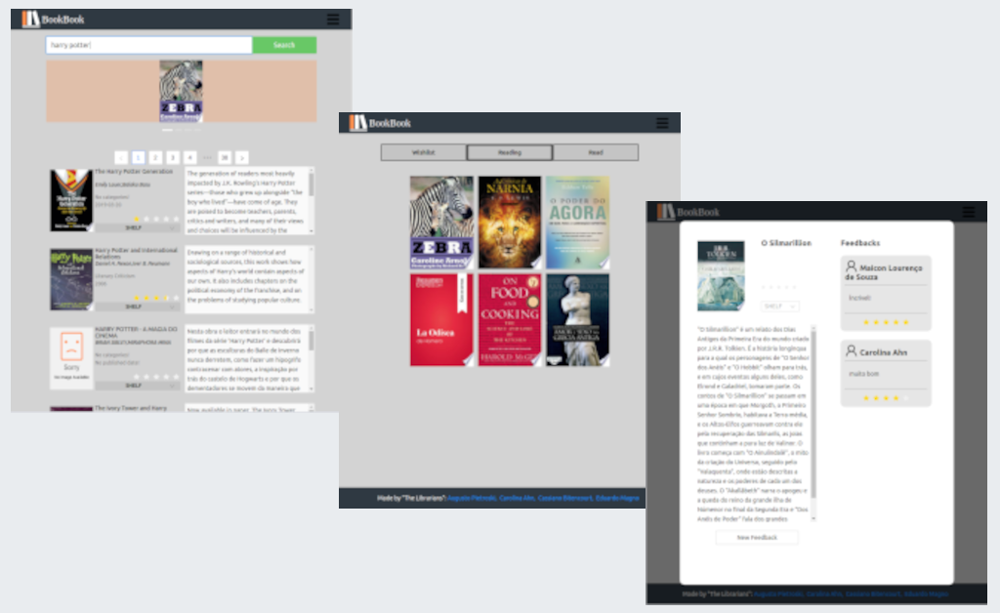

# Book-book

## Sobre

Este projeto trata-se de um MVP de uma **Rede social para busca e avaliação de livros**

<h1 align = center>
    
</h1>

## Acesse a Plataforma - **[Book Book](https://book-book-zeta.vercel.app/)**

**cadastre um usuário**

ou utilize a **conta** : user - cacakenzie11 / senha - cacakenzie11

## Funcionalidades:

Projeto implementado no curso da [Kenzie Academy](https://kenzie.com.br/) em setembro de 2020;

- permite o cadastro de usuários;
- permite a busca por livros através da API Google Books;
- usuário pode visualizar o rating, resumo e reviews dos livros;
- usuário pode adicionar livros às suas prateleiras;
- usuário pode editar reviews e visualizar os livros das prateleiras de outros usuários.

## Tecnologias:
- JavaScript, React, Redux;
- Styled components, Antd;
- Vercel.

## Time(gestão ágil - scrum):

###### [Augusto Pietroski - Tech Lead](https://www.linkedin.com/in/augusto-pietroski/)

###### [Carolina Ahn - PO](https://www.linkedin.com/in/carolina-ahn/)

###### [Cassiano Bitencourt - QA](https://www.linkedin.com/in/cassiano-doederlein-648592148/)

###### [Eduardo Magno - Scrum Master](https://www.linkedin.com/in/edu-magno/)

